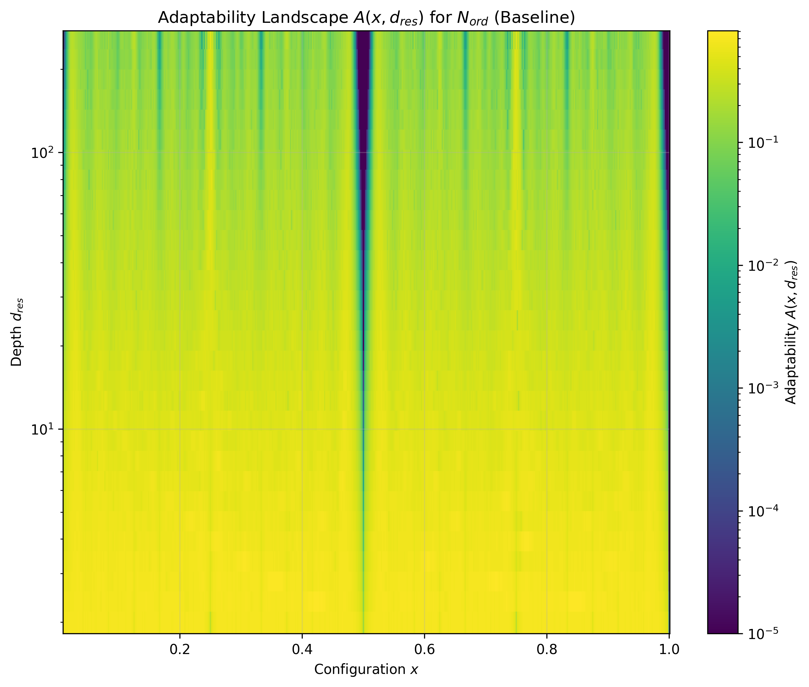
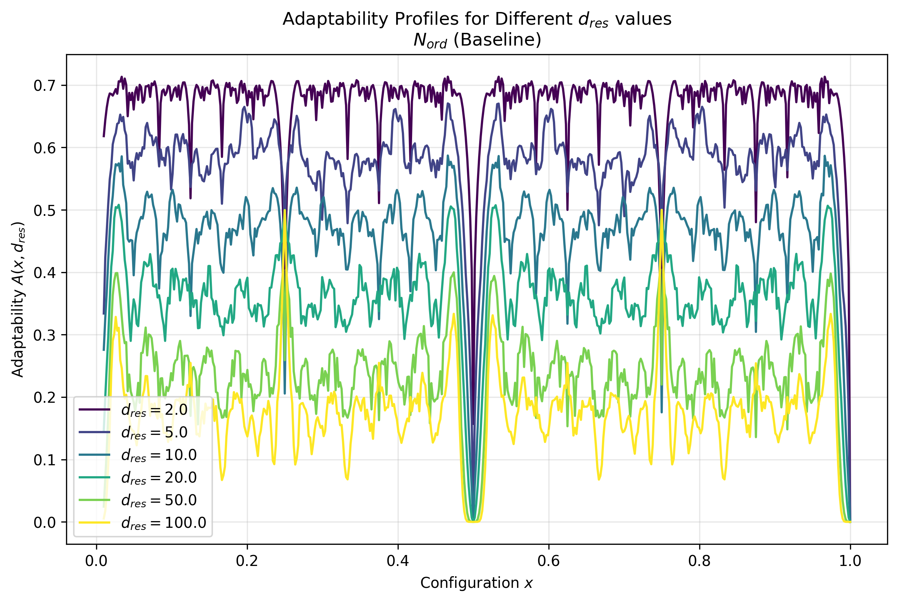
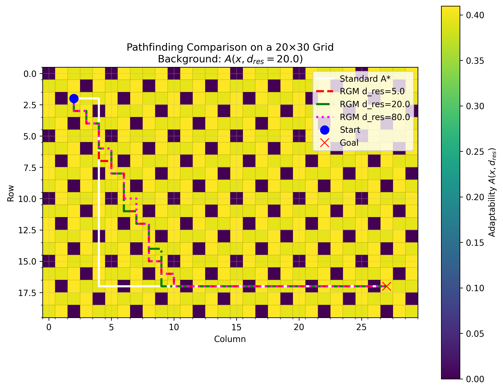

<div align="center">
  
</div>

<div align="center">
  
  [](https://opensource.org/licenses/MIT)
  [](https://www.python.org/downloads/)
  [](https://numpy.org/)
  [](https://matplotlib.org/)
  [](https://www.latex-project.org/)
  
</div>

<div align="center">
  <h3>
    <a href="#features">Features</a> •
    <a href="#installation">Installation</a> •
    <a href="#usage">Usage</a> •
    <a href="#mathematical-framework">Mathematical Framework</a> •
    <a href="#examples">Examples</a> •
    <a href="#documentation">Documentation</a> •
    <a href="#citation">Citation</a>
  </h3>
</div>

---

# Resonance-Guided Search: A Novel Heuristic Framework

> **Resonance-Guided Search (RGS)** is a mathematically rigorous framework for pathfinding and optimization that incorporates adaptability considerations from conserved systems. By modulating standard distance metrics with an adaptability function, RGS guides search algorithms toward solutions that balance efficiency with robustness.

## 🌟 Features

- **Adaptability Metric**: Compute and visualize the adaptability landscape for various orbital orders and depth parameters
- **Resonance-Guided Metric (RGM)**: Modulate standard distance metrics to guide search toward adaptable states
- **Pathfinding Algorithms**: Compare standard A* search with RGM-guided A* search in grid-based environments
- **2D Adaptability**: Extend adaptability calculations to 2D configuration spaces.
- **Adaptive RGM Pathfinding**: Dynamically adjust `d_res` during pathfinding for potentially improved search behavior.
- **Visualization Tools**: Generate heatmaps, profiles, and pathfinding comparisons
- **Mathematical Proofs**: Includes rigorous proofs for key properties of the framework
- **Comprehensive Testing**: Verify all theoretical claims through unit tests
- **Interactive Demo**: Explore the framework's behavior through an interactive Jupyter notebook

## 🔧 Installation

```bash
# Clone the repository
git clone https://github.com/yourusername/resonance-guided-search.git
cd resonance-guided-search

# Create a virtual environment (optional but recommended)
python -m venv venv
source venv/bin/activate  # On Windows: venv\Scripts\activate

# Install dependencies
pip install -r requirements.txt
```

## 📊 Usage

### Core Functionality

```python
from src.rgs_core import adaptability, rgm_distance

# Calculate adaptability for a specific configuration
x = 0.5
d_res = 10.0
N_ord = list(range(1, 13))  # Orbital orders {1, 2, ..., 12}
a = adaptability(x, d_res, N_ord)
print(f"Adaptability at x={x}: {a}")

# Calculate RGM distance between two points
x1, x2 = 0.3, 0.7
d_base = abs(x1 - x2)  # Base distance (e.g., Euclidean)
d_rgm = rgm_distance(x1, x2, d_res, N_ord, d_base, w=2.0)
print(f"Base distance: {d_base}, RGM distance: {d_rgm}")

# --- 2D RGS Core Functionality ---
from src.rgs_core import adaptability_2d, rgm_distance_2d
# import numpy as np # Required for np.sqrt

# Calculate 2D adaptability
pos = (0.5, 0.3)
x0_vec = (0.0, 0.0)
# Assume d_res and N_ord are defined as in the 1D example above
a_2d = adaptability_2d(pos, d_res, N_ord, x0_vec)
print(f"2D Adaptability at pos={pos}: {a_2d}")

# Calculate 2D RGM distance
pos1, pos2 = (0.3, 0.2), (0.7, 0.6)
d_base_2d = np.sqrt((pos1[0]-pos2[0])**2 + (pos1[1]-pos2[1])**2) # Euclidean
d_rgm_2d = rgm_distance_2d(pos1, pos2, d_res, N_ord, d_base_2d, w=2.0, x0_vec=x0_vec)
print(f"Base 2D distance: {d_base_2d}, 2D RGM distance: {d_rgm_2d}")
```

### Visualization

```python
from src.rgs_viz import plot_adaptability_landscape, plot_adaptability_profile

# Plot adaptability landscape
fig, ax = plot_adaptability_landscape(
    x_range=(0, 1),
    d_res_range=(1, 100),
    N_ord=list(range(1, 13)),
    log_scale_d_res=True
)

# Plot adaptability profiles for different d_res values
fig, ax = plot_adaptability_profile(
    x_range=(0, 1),
    d_res_values=[1.0, 5.0, 10.0, 50.0],
    N_ord=list(range(1, 13))
)

# --- 2D Visualization ---
from src.rgs_viz import plot_adaptability_landscape_2d, plot_grid_pathfinding_2d_background

# Plot 2D adaptability landscape
fig_2d_land, ax_2d_land = plot_adaptability_landscape_2d(
    x_coords_range=(0, 1),
    y_coords_range=(0, 1),
    d_res=10.0, # Example d_res
    N_ord=list(range(1, 13))
    # x0_vec can be specified if not (0.0, 0.0)
)

# plot_grid_pathfinding_2d_background can be used similarly to plot_grid_pathfinding,
# but requires a grid_to_xy_map and uses 2D adaptability for the background.
# (See pathfinding examples for grid_to_xy_map).
```

### Pathfinding

```python
from src.rgs_pathfinding import standard_a_star, rgm_a_star

# Define grid parameters
grid_size = (20, 30)
start = (2, 2)
goal = (17, 27)

# Define mapping from grid positions to x values
def grid_to_x_map(row, col):
    return ((row * 0.1 + col * 0.05) * 2.0) % 2.0

# Run standard A* search
standard_path = standard_a_star(grid_size, start, goal)

# Run RGM-guided A* search
rgm_path = rgm_a_star(
    grid_size=grid_size,
    start=start,
    goal=goal,
    grid_to_x_map=grid_to_x_map,
    d_res=20.0,
    N_ord=list(range(1, 13)),
    w=2.0
)

# --- Adaptive RGM A* Search (1D Adaptability Background) ---
from src.rgs_pathfinding import adaptive_rgm_a_star

adaptive_path = adaptive_rgm_a_star(
    grid_size=grid_size,
    start=start,
    goal=goal,
    grid_to_x_map=grid_to_x_map, # Same grid_to_x_map as rgm_a_star
    N_ord=list(range(1, 13)),
    d_res_far=5.0,   # d_res when far from goal
    d_res_near=80.0, # d_res when near goal
    w=2.0
)
print(f"Adaptive RGM A* path length: {len(adaptive_path)}")

# --- RGM A* Search with 2D Adaptability Background ---
from src.rgs_pathfinding import rgm_a_star_2d

# Define mapping from grid positions to (x,y) float tuples
def grid_to_xy_map(row, col):
    # Example: map to unit square
    # Assumes grid_size is defined, e.g., grid_size = (20,30)
    x_val = float(col) / grid_size[1] 
    y_val = float(row) / grid_size[0]
    return (x_val, y_val)

rgm_path_2d = rgm_a_star_2d(
    grid_size=grid_size,
    start=start,
    goal=goal,
    grid_to_xy_map=grid_to_xy_map,
    d_res=20.0,
    N_ord=list(range(1, 13)),
    w=2.0,
    x0_vec=(0.0, 0.0)
)
print(f"RGM A* (2D background) path length: {len(rgm_path_2d)}")
```

### Running Tests

```bash
# Run all tests
python -m unittest discover tests

# Run specific test file
python -m tests.test_mathematical_properties
```

### Compiling the LaTeX Report

```bash
# Compile the LaTeX report
bash compile_latex.sh
```

## 🧮 Mathematical Framework

The RGS framework is built upon two key mathematical constructs:

### Adaptability Metric

The adaptability metric $A(x, d_{res})$ is defined as the average of coupling functions across a set of orbital orders:

$$A(x, d_{res}) = \frac{1}{|N_{ord}|} \sum_{n \in N_{ord}} h_n(x, d_{res})$$

where the coupling function $h_n(x, d_{res})$ for orbital order $n$ is:

$$h_n(x, d_{res}) = \left|\sin(n\cdot\theta(x))\right|^{d_{res}/n} \cdot \left|\cos(n\cdot\phi(x, d_{res}))\right|^{1/n}$$

with $\theta(x) = 2\pi(x - x_0)$ and $\phi(x, d_{res}) = d_{res}\pi(x - x_0)$.

### Resonance-Guided Metric

The Resonance-Guided Metric (RGM) modifies a base distance metric by incorporating adaptability values:

$$d_{rgm}(x_1, x_2) = d_{base}(x_1, x_2) \cdot f_{mod}\left(A(x_1, d_{res}), A(x_2, d_{res})\right)$$

where the modulating function is:

$$f_{mod}(A_1, A_2) = \frac{1}{1 + w \cdot \frac{A_1 + A_2}{2} + \epsilon}$$

## 📈 Examples

### Adaptability Landscapes

<div align="center">
  
  
</div>

### Pathfinding Comparison

<div align="center">
  
</div>

## 📚 Documentation

The codebase is structured into three main modules:

- **`rgs_core.py`**: Core mathematical functions for computing adaptability and RGM
- **`rgs_viz.py`**: Visualization functions for adaptability landscapes and profiles
- **`rgs_pathfinding.py`**: Implementation of standard and RGM-guided A* search

For detailed documentation, see the [full report](docs/pdf/report.pdf).

## 📋 Project Structure

```
resonance-guided-search/
├── docs/
│   ├── pdf/
│   │   └── report.pdf
│   └── tex/
│       └── report.tex
├── figures/
│   ├── A_landscape_Baseline.png
│   ├── A_landscape_Sparse.png
│   ├── A_profiles_Baseline.png
│   └── pathfinding_comparison.png
├── src/
│   ├── __init__.py
│   ├── rgs_core.py
│   ├── rgs_pathfinding.py
│   └── rgs_viz.py
├── tests/
│   ├── __init__.py
│   ├── test_adaptability_landscape.py
│   ├── test_adaptive_rgm.py  # New
│   ├── test_mathematical_properties.py
│   ├── test_rgm_pathfinding.py
│   └── test_2d_adaptability_and_rgm.py # New
├── notebooks/
│   └── rgs_interactive_demo.ipynb
├── compile_latex.sh
├── requirements.txt
└── README.md
```

## 📝 Citation

If you use this framework in your research, please cite:

```bibtex
@article{resonance_guided_search,
  title={Resonance-Guided Search: A Novel Heuristic Framework Based on Adaptability in Conserved Systems},
  author={Your Name},
  journal={arXiv preprint},
  year={2023}
}
```

## 🔗 Related Work

- [A* Search Algorithm](https://en.wikipedia.org/wiki/A*_search_algorithm)
- [Heuristic Search](https://en.wikipedia.org/wiki/Heuristic_(computer_science))
- [Fractal Geometry](https://en.wikipedia.org/wiki/Fractal)
- [Conservation Laws in Physics](https://en.wikipedia.org/wiki/Conservation_law)

## 📄 License

This project is licensed under the MIT License - see the [LICENSE](LICENSE) file for details.

## 🤝 Contributing

Contributions are welcome! Please feel free to submit a Pull Request.

---

<div align="center">
  <sub>Built with ❤️ by Your Name</sub>
</div>
